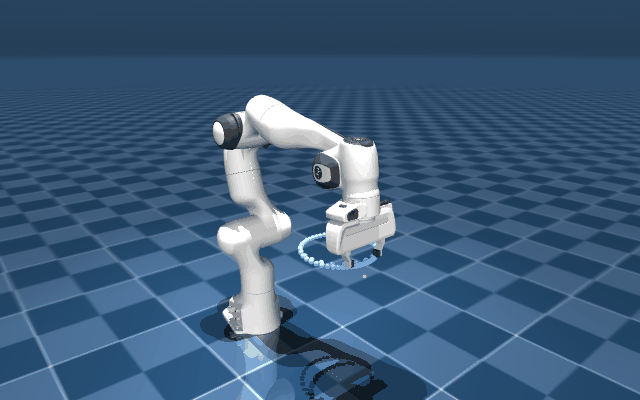

<div align="center">

# panda-dls

**基于 MuJoCo 与阻尼最小二乘（DLS）的 7 自由度机械臂笛卡尔空间轨迹跟踪与姿态控制**

*Python 手写 MDH 运动学 · DLS 分辨率速度控制 · 自适应阻尼 · 零空间冗余优化 · 力矩级操作空间控制 · QP 硬约束求解 · MuJoCo 物理仿真闭环*




</div>

---

## 特性

- 运动学全部手写：MDH（Craig 改进 DH）FK 与几何雅可比均为纯 NumPy 实现，随机 500 位形与 MuJoCo 官方实现（`mj_kinematics` / `mj_jac`）比对到 $10^{-15}$ 量级；
- DLS 分辨率速度控制：阻尼 $\lambda$ 随最小奇异值 $\sigma_{\min}$ 在线调度，远离奇异时退化为伪逆（零偏置），接近奇异时平滑加阻尼；
- 位置与姿态双任务：姿态误差经 so(3) 对数映射进入 6D twist，参考姿态用四元数 slerp 生成，评估采用 chordal 距离换算物理转角；
- 冗余利用：零空间投影挂载可操作度最大化与关节限位中值吸引两个次任务，主任务误差不受影响；
- 力矩级操作空间控制（Khatib）：任务空间惯量 $\Lambda=(JM^{-1}J^T+\lambda^2I)^{-1}$、重力/科氏前馈、动力学一致零空间，$M$ 与偏置力直接取自 MuJoCo 递推，$\dot J\dot q$ 用方向差分估计，闭环精度反超速度级运动学层一个量级；
- QP 硬约束控制器：关节限位/速度/加速度与末端安全平面统一进 OSQP 求解（warm start 单步 $\sim$0.1 ms），限位不再靠事后裁剪——解沿可行域边界滑动，硬保证不越界；
- 结论可复现：阻尼策略、零空间、前馈、控制层级、执行层级、约束求解六组对照实验，一键出全部图表。

## 结果

| 指标 | 数值 |
|---|---|
| MDH-FK 比对 `mj_kinematics`（500 随机位形） | 位置 / 旋转最大误差 $\sim 10^{-15}$ |
| 几何雅可比对准 `mj_jac`（hand 参考点） | 逐元素误差 $3.7\times 10^{-15}$ |
| 静态 IK 收敛率（随机可达位姿，两阶段 + 多起点） | $96\%$（48/50） |
| 空间圆跟踪 · 运动学层（1 圈 13 s，1 kHz） | 位置 RMS $0.04$ mm，姿态 max $0.01^\circ$ |
| 空间圆跟踪 · 动力学层（PD 位置舵机） | 位置 RMS $4.2$ mm，姿态 max $1.28^\circ$ |
| 奇异实验 · 伸向工作空间边界直至 $\sigma_{\min} \to 0$ | 伪逆关节速度需求 $889$ rad/s vs 自适应 DLS $1.1$ rad/s |
| 零空间可操作度最大化 | 边界处可操作度保持 $3.5\times$，主任务误差几乎重合 |
| 零空间限位救援（起始 $q_7$ 贴近限位） | 关：撞限位 + 姿态误差 $6.58^\circ$；开：不贴限 + $0.01^\circ$ |
| 轨迹前馈 开 / 关 | 位置 RMS $0.04$ mm vs $46.2$ mm |
| 操作空间控制（13 s 空间圆 + 姿态摆动） | 位置 RMS $0.002$ mm，姿态 max $0.0007^\circ$，力矩峰值 $23$ N·m —— 比位置舵机低三个量级 |
| QP 硬限位（q7 贴限位起始，安全裕度 $0.02$ rad） | 裕度全程精确保持 $0.020$，姿态 max $0.03^\circ$（DLS+clip 撞限位：裕度 $0$、姿态 $6.58^\circ$） |
| QP 末端安全平面（参考轨迹穿平面下探 $54$ mm） | 全程 $0$ 步越界，误差恰为参考越界量（有界） |

## 安装

**环境要求**：Python 3.12+、MuJoCo 3.11+（模型文件已随仓库放在 `models/`，无需额外下载）。

```bash
pip install mujoco numpy matplotlib imageio imageio-ffmpeg scipy osqp pytest
```

## 快速开始

```bash
# 按需把 python 换成你虚拟环境的解释器路径
cd demo
python scripts/run_verify.py        # 自检：FK / 雅可比 / 四元数 vs MuJoCo（改代码后必跑）
python scripts/run_ik_test.py       # 静态 IK 收敛率统计
python -m pytest tests/ -q          # 单元测试（12 项）
python scripts/run_track.py         # 主 demo：动力学层闭环跟踪 + 图表 + GIF/MP4
python scripts/run_track.py --view  # 实时 viewer 查看
python scripts/run_experiments.py   # 四组对比实验 + 自动出图
python scripts/run_osc.py           # 执行层级三方对比: 运动学层 / 位置舵机 / 操作空间控制
python scripts/run_qp.py            # QP 硬约束: 贴限位救援 + 末端安全平面
```

`run_verify.py` 的预期输出以 5 个 `[PASS]` 结尾；`run_track.py` 结束后图表与媒体写入 `results/`。

## 原理

参考轨迹给出期望位姿与前馈速度，手写 MDH 运动学算出当前位姿与雅可比，DLS 把 6D 误差映射为关节速度，MuJoCo 负责积分与渲染。

$$\Delta q  =  \underbrace{J^T(JJ^T+\lambda^2 I_6)^{-1}(K e+\dot{x}_d)}_{\text{主任务：DLS 分辨率速度控制}}  +  \underbrace{(I_7-J^T(JJ^T+\lambda^2 I_6)^{-1}J) k_n z(q)}_{\text{零空间次任务}}$$

- 误差 $e = [ p_d - p,  \log(R_d R^T)^\vee ]$：姿态走 so(3) 对数映射（短弧、无双覆盖），与雅可比角速度行同处世界系；
- 自适应阻尼 $\lambda^2=\lambda_0^2(1-(\sigma_{\min}/\varepsilon)^2)$，当 $\sigma_{\min} \ge \varepsilon$ 时取 0：SVD 视角下每个奇异方向的增益由 $1/\sigma$ 压为 $\sigma/(\sigma^2+\lambda^2)$；
- 零空间投影 $N(q) = I_7 - J^+ J$ 把次任务 $z(q)$（限位中值吸引 / 可操作度梯度）限制在不影响主任务的方向。

## 目录结构

```text
demo/
├── panda_dls/            # 核心包（除自检外全部纯 NumPy 手写）
│   ├── kinematics.py     # MDH 参数表 / FK / 几何雅可比
│   ├── quaternion.py     # 四元数乘法 / so(3) 对数映射 / 四元数 slerp / chordal 度量
│   ├── dls.py            # DLS 求解 / 自适应阻尼 / 零空间 / 两阶段静态 IK
│   ├── traj.py           # 五次多项式时间律 / 空间圆 / 直线轨迹（含加速度前馈）
│   ├── osc.py            # 操作空间控制: 任务空间惯量 / 动力学前馈 / 力矩级闭环
│   ├── qp.py             # QP 约束控制器: OSQP 求解限位/限速/安全平面
│   ├── control.py        # MuJoCo 仿真闭环 (运动学层 / 动力学层)
│   └── viz.py            # 指标曲线 / 实验图 / GIF + MP4 渲染
├── models/               # Franka Panda 模型（来自 mujoco_menagerie, panda_motor.xml 为力矩执行器变体）
├── scripts/              # run_verify / run_ik_test / run_track / run_experiments / run_osc / run_qp
├── tests/                # pytest：对准测试、四元数性质、DLS 收敛、QP 正确性、OSC 冒烟
├── results/              # 实验图表、demo.gif / demo.mp4、npz 日志
└── docs/                 # 讲解文档
```

## 实验

| 图表 | 看什么 | 结论 |
|---|---|---|
| `results/singularity.png` | $\lVert \Delta q \rVert_\infty$（对数轴）与 $\sigma_{\min}$ 曲线，在 $t \approx 6$ s 处到达工作空间边界 | 伪逆需求飙至 $889$ rad/s；固定阻尼平滑但滞后 $48$ mm；自适应阻尼 $1.1$ rad/s 且滞后最小 |
| `results/nullspace_manip.png` | 可操作度 $m(q)$ 与主任务误差 | 梯度项把边界处 $m$ 抬高 $3.5\times$，主任务不受损 |
| `results/nullspace_limit.png` | $q_5$ / $q_7$ 关节姿态与限位裕度 | 零空间提前把 $q_7$ 拉离限位，姿态误差 $6.58^\circ\to 0.01^\circ$ |
| `results/feedforward.png` | 前馈开/关的误差曲线 | 纯反馈滞后 $\propto$ 速度，误差从 $46$ mm 降到 $0.04$ mm |
| `results/stage_ab.png` | 运动学层 vs 动力学层 | $0.04$ vs $4.2$ mm：算法误差与执行误差的分解 |
| `results/track_dyn.png` | 误差双轴曲线 | 误差峰与五次多项式速度包络同步，物理自洽 |
| `results/osc_compare.png` | 运动学层 / 位置舵机 / 操作空间控制三方误差 | 位置舵机 $4.2$ mm 的执行误差被 OSC 的动力学前馈压回 $0.002$ mm |
| `results/qp_limit.png` | 贴限位起始的 $q_7$ 轨迹与误差 | 裁剪钉死限位（$6.58^\circ$），零空间软约束无保证，QP 硬约束裕度精确 $0.020$ |
| `results/qp_plane.png` | 末端高度 vs 安全平面 | QP 全程钳在平面上（$0$ 步越界），误差恰为参考越界量 |

## 定位与局限

本项目是个人学习性质的机械臂运动控制实现：运动学层已对到实机频率精度；动力学层从现成 PD 位置舵机升级为力矩级操作空间控制（Khatib），任务空间动力学全部前馈补偿；约束处理从"解析投影 + 事后裁剪"升级为 OSQP 硬约束 QP。后续方向：任务优先级栈、TOPP-RA 时间参数化、C++/Eigen 移植与真机接口。
